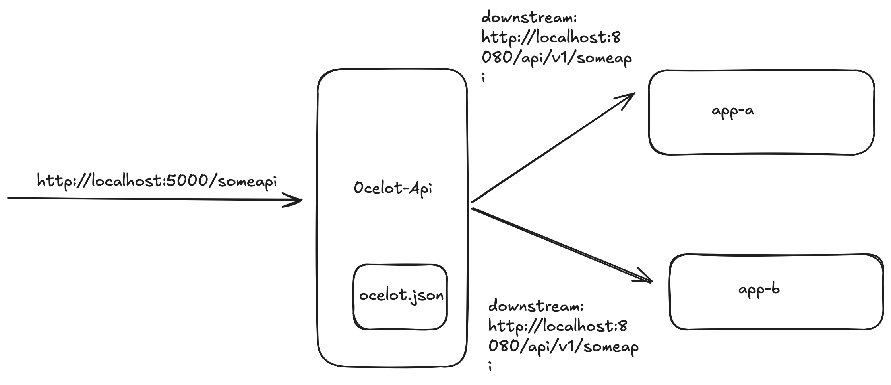

# ocelot-api-gateway

Ocelot is a lightweight, fast, and scalable API Gateway built on .NET Core. This repository demonstrates how to set up Ocelot using Docker and Docker Compose.

---

## Features ✨
- Simple configuration with `ocelot.json`.
- Ready-to-run Docker environment.
- Scalable with Docker Compose.

---

## Configuration 📝
- ocelot.json
 
   Define routes and downstream services in ocelot.json

# Acknowledgments 🙏

- Ocelot Documentation - Getting Started [https://ocelot.readthedocs.io/en/latest/introduction/gettingstarted.html](https://ocelot.readthedocs.io/en/latest/introduction/gettingstarted.html)
